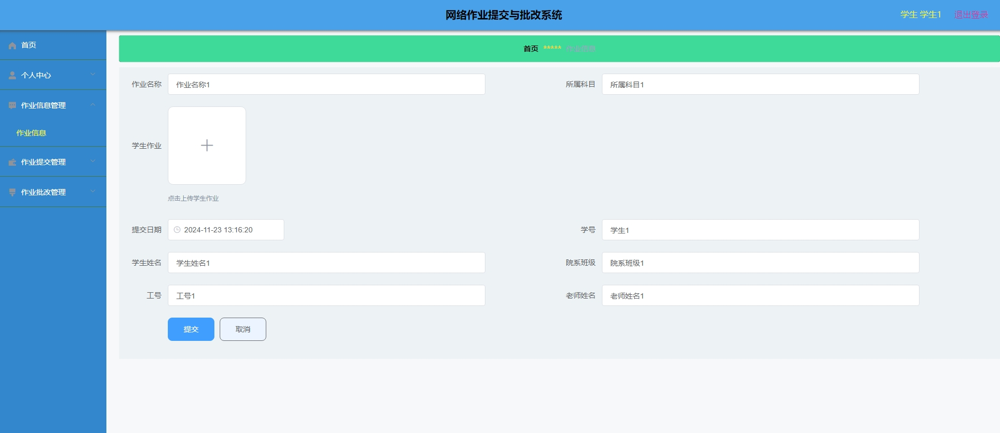
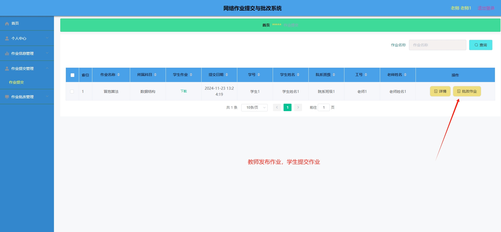

# 1.项目介绍
- 功能模块：管理员（学生管理、教师管理、作业信息管理、作业提交管理、作业批改管理等）、学生（个人信息管理、作业提交、作业查看等）、教师（个人中心、作业创建、作业批改等）
- 技术选型：SSM、vue、等
- 测试环境：idea2024，mysql5.7，maven3，tomcat8，jdk1.8，navicat
# 2.项目部署
- 通过navicat等工具创建数据库，导入db下的sql文件
- 通过idea打开项目，根据本地的数据库环境配置src/main/resources/config.properties  3-6行（强调：数据库向下兼容，如果你本地数据库是8.*的，请注意修改pom.xml的版本，以及对应的数据库url添加时区，同时驱动名称要做修改）
- 配置tomcat，我的测试环境的application context配置为/ssm5t4c8
- 启动项目
- 后端管理web：http://localhost:8080/ssm5t4c8/admin/dist/index.html  管理员账号密码：abo、abo；学生账号密码：学生1、123456；教师账号：老师1、123456
- 账号自己查看表就行
# 3.项目部分截图

# 4.获取方式
[戳我查看](https://gitee.com/aven999/mall)
